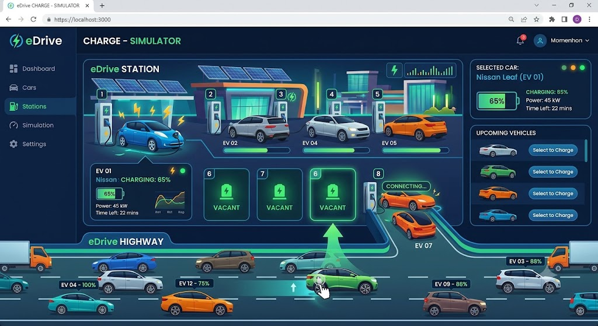

## Overview

This repository now includes a runnable client-first MVP shell for the EV charging station simulator.

Current stage includes:

* Dashboard tab with working charging bay assignment flow, battery progression, and cumulative kWh metrics.
* Cars, Stations, Simulation, and Settings as navigable placeholder tabs with explicit future-stage messaging.
* React + TypeScript + Vite app scaffolded under `src/webapp`.

## MVP Tab Scope

The initial MVP should focus only on the Dashboard tab.

* Dashboard tab: full charging station simulation experience
* Cars tab: functional placeholder text only
* Stations tab: functional placeholder text only
* Simulation tab: functional placeholder text only
* Settings tab: functional placeholder text only

Placeholder tabs should render clear messaging that the content will be implemented in future stages.

## Product Direction

Primary product requirements are documented in [docs/prd-vehicle-charging.md](docs/prd-vehicle-charging.md).

Use this visual reference as the target interaction style and atmosphere:



## Quickstart

From the repository root:

```powershell
cd src\webapp
npm install
npm run dev
```

Build and quality check:

```powershell
cd src\webapp
npm run lint
npm run build
```

## Repository Layout

```text
├── README.md
├── src/
│   └── webapp/
│       ├── src/
│       ├── package.json
│       └── vite.config.ts
└── docs/
    ├── images/
    ├── install-squad.md
    └── prd-vehicle-charging.md
```

## Next Implementation Scope

Initial build focus should include:

* Roadway animation engine for continuously moving traffic
* Regular car generation and controlled slow roadway movement
* Click-to-charge interaction and slot assignment behavior
* Charging lifecycle state machine (enter, charge, exit, rejoin)
* Live battery progress visualization for each active charging session
* Cumulative total energy dispensed counter
* Responsive modern UI for desktop and mobile

## Contributing

* Keep PRDs in docs/ using the pattern prd-*.md.
* Keep visual references under docs/images/.
* Follow repository Copilot and coding instructions when adding source code and infrastructure artifacts.
